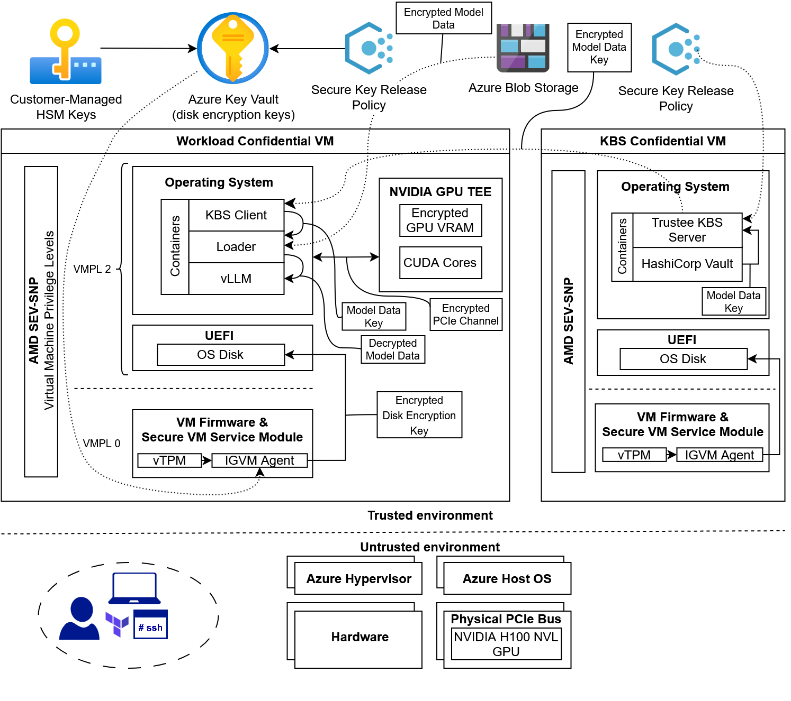

# Azure Confidential VM with GPU Deployer

Securely deploy and serve Large Language Models (LLMs) on Microsoft Azure using Confidential Virtual Machines (CVMs) utilizing hardware-attested AMD SEV-SNP CPUs and NVIDIA GPUs. 

This project demonstrates a zero-trust architecture for AI inference. By leveraging hardware-based Trusted Execution Environments (TEEs) and Secure Key Release (SKR) workflows, the AI model weights and user prompts remain encrypted at all times (Data-at-Rest + Data-in-Use). Not even the cloud provider or host hypervisor can access the plaintext data.

---

## Architecture Overview

This Proof of Concept (PoC) provisions two primary environments via Terraform:

1. **Trustee Key Broker Service (KBS) CVM:** A secure broker that validates hardware attestation evidence before releasing decryption keys. Backed by HashiCorp Vault as secret storage.
   - Azure Confidential VM utilizing AMD's SEV-SNP technology: 
     - Azure VM Size: Standard_DC2as_v6
     - CPU: 2 vCPUs - AMD EPYC 9004 (Genoa)
     - RAM: 8 GiB
     - Local storage: 30 GiB for OS disk. Protected by server-side disk encryption with customer-managed, HSM-backed keys with Secure Key Release policy.
     - OS: Ubuntu 22.04 LTS. Official Azure Confidential VM image by Canonical
   - 2 Docker containers:
     - **Trustee KBS** - for standalone Key Broker Service and Attestation Service, utilizing the NVIDIA Remote Attestation Service to verify the evidence received from GPU.
     - **HashiCorp Vault** - for local secret storage
2. **Confidential AI Workload CVM:** A GPU-accelerated node running a custom vLLM container. It undergoes CPU and GPU attestation, requests a Secure Key Release of the AI model decryption key, and loads the LUKS-encrypted model into a secure RAM disk.
    - Azure Confidential GPU VM with NVIDIA GPU in Confidential Compute mode and AMD SEV-SNP enabled CPU:
      - Azure VM size: Standard_NCC40ads_H100_v5
      - CPU: 40 vCPUs - AMD EPYC 9V84 (Genoa)
      - GPU: NVIDIA H100 NVL with 94 GB VRAM
      - RAM: 320 GiB
      - Local storage: 100 GiB for OS disk. Protected by server-side disk encryption with customer-managed, HSM-backed keys with Secure Key Release policy.
      - OS: Ubuntu 22.04 LTS. Official Azure Confidential VM image by Canonical
    - 3 Docker containers:
      - **KBS Client** - securely utilizes a vTPM and NVIDIA GPU attestation SDK to submit a CPU and GPU evidence bound to the Root of Trust originating in AMD and NVIDIA hardware to a KBS Server and Attestation Service via the Request - Challenge - Attestation - Response (RCAR) sequence, and to invoke a Secure Key Release (SKR) of the Workload Encryption Key.
      - **Loader** - receives the Workload Encryption Key from the **KBS Client** via a shared ephemeral `tmpfs` volume, mounts the encrypted `LUKS` image file stored in Azure Storage containing the AI model weights, copies the AI model weights data from the encrypted volume to the secured RAM volume inside the TEE of the CVM, and unmounts the encrypted volume.
      - **vLLM** - starts the vLLM inference service.

### Key Components
* **Infrastructure as Code:** Terraform (`azurerm`, `azuread`, `cloudinit`).
* **Compute:** Azure Confidential VMs (AMD EPYC Genoa) + NVIDIA H100 NVL GPUs.
* **Key Management:** Azure Key Vault (Premium) with HSM-backed keys, HashiCorp Vault.
* **Attestation:** 
    - Two-layered attestation: 
       - Microsoft Azure Attestation (MAA) with Secure Key Release of OS disk encryption keys. Disk encryption keys are released after successful verification of AMD SEV-SNP CPU claims and Azure CVM configuration claims from each VM pre-boot.
       - Private Trustee KBS Attestation Service (AS) with Secure Key Release policies for AI model encryption key. AS validates combined AMD SEV-SNP CPU claims and GPU claims verified and endorsed by NVIDIA Remote Attestation Service (NRAS), and releases symmetric encryption key wrapped by ephemeral key generated by vTPM.
* **Inference Engine:** 
    - `vLLM` running the Qwen 3.8-27B model (configurable).

---

## Prerequisites

Before deploying this infrastructure, ensure you have the following:

* **Azure Subscription:** With quota approved for `Standard_NCC40ads_H100_v5` and `Standard_DC2as_v6` instances (Central US region recommended for availability).
* **Azure CLI:** Authenticated (`az login`) with permissions to create Resource Groups, Key Vaults, Role Assignments, and Managed Identities.
* **Terraform:** Installed locally (v1.5+).
* **GitHub Container Registry (GHCR):** A Personal Access Token (PAT) with `read:packages` scope to pull the custom KBS and client images.
* **SSH Key Pair:** SSH public key available at path specified in `cvm_poc_admin_ssh_pubkey_path` of `variables.tf` file (or create/modify `terraform.tfvars`).

---

## 🚀 Deployment Guide

### 1. Prepare and Upload the Encrypted AI Model Data
 1. Use [download_model.sh](scripts/download_model.sh) script to download and encrypt an open weights model from huggingface.
 2. Proceed with the steps from the sections below to deploy an Azure Storage Account via the `terraform apply`, then return here.
 3. Open Azure web interface.
 4. Navigate to `cvm_poc_rg` resource group -> `cvmpocstoreXXXXXXXX` Storage account -> Storage browser -> Blob containers -> Click on your `models` container -> Upload.
 5. Upload the encrypted model image prepared in step 1.

 _Note: Alternatively, you can use an `Azure CLI` or `azcopy` commands to upload the encrypted image to your Azure storage account._

### 2. Clone the Repository

    git clone https://github.com/valzaitsev/cvm-deployer.git
    cd cvm-deployer

### 3. Configure Variables
Create a `terraform.tfvars` file to securely pass your credentials and specific configurations:

    cvm_poc_admin_username = "your_admin_username_for_VMs"
    cvm_poc_admin_ssh_pubkey_path = "~/.ssh/your_ssh_public_key.pub"

    # Github credentials to download custom docker containers for patched Trustee KBS server and precompiled KBS Client with built-in NVIDIA SDK
    # TODO: make them public and available, and eliminate these variables
    ghcr_username = "your_github_username"
    ghcr_token    = "ghp_your_personal_access_token"

    # Top-level directory name in Azure Storage Account, e.g. "models"
    azure_storage_container_name = "your_container_name_for_models"
    
    # File name with encrypted LUKS volume, e.g. "model.img"
    encrypted_image_name = "your_encrypted_model_image.img"         

    # POC-only: secret key to be injected into the Vault
    workload_key  = "your_super_secret_luks_key" 

    # Model name to serve in vLLM
    workload_model_name = "Qwen/Qwen3.8-27B"

### 4. Initialize and Apply

    terraform init
    terraform plan -out=tfplan
    terraform apply tfplan

Execution times:
- Terraform deployment including the Key Vault RBAC propagation and Confidential VM creation and first start up: ~5-10 minutes.
- Cloud configuration (`cloud-init`) scripts in VMs, GPU drivers installation and configuration, and deployment of docker images: ~10-15 minutes.
- Encrypted AI model download from Azure Blob storage: ~10-15 minutes.

---

## Usage & Testing

Once the Terraform apply is complete, the Workload VM will boot, authenticate via Trustee KBS, download the LUKS key, decrypt the model into the secure `tmpfs`, and start the `vLLM` server.

To interact with the running model, SSH into the Workload VM and use the provided testing scripts:

    # SSH into the Workload VM (IP provided in Terraform outputs)
    ssh your-admin-user@<CVM_PUBLIC_IP>

    # Run the inference test script
    cd /opt/cvm_workload
    ./chat2.py

---

## TO-DOs & Security and Architecture Roadmap

While this Proof of Concept successfully demonstrates a full end-to-end Confidential AI deployment, several architectural optimizations are planned to reach enterprise-grade security. The current implementation trusts the OS image implicitly and handles keys in user-space RAM. In addition, this proof-of-concept infrastructure hosts the private Attestation Service and Vault with the key for AI model in the same cloud. The following roadmap addresses these remaining threat vectors.

### 1. Cryptographic OS & Boot Measurement (Full Stack Attestation)
Currently, the attestation flow verifies the hardware integrity (AMD SEV-SNP, NVIDIA H100 NVL) and VM configuration (e.g., SMT and debug disabled). However, it does not strictly bind to the OS image itself. 
* **Threat:** A compromised cloud administrator could substitute the intended Ubuntu CVM image with a malicious one designed to intercept the unencrypted model or prompts.
* **Solution:** Update the Trustee KBS Rego policies to validate the Guest OS launch measurements and vTPM Platform Configuration Registers (PCRs). By explicitly defining authorized kernel and OS image hashes in the policy reference values, the Key Broker Service will only release the workload key if the exact, unmodified OS image is running.

### 2. Zero User-Space Key Exposure (Kernel Keyring & dm-crypt)
Currently, the `kbs-client` requests the model decryption key and outputs it temporarily to a secure `tmpfs` RAM disk, where `cryptsetup` reads it to unlock the LUKS volume.
* **Threat:** Even on a secure RAM disk, handling the plaintext key in user-space leaves a theoretical window for memory scraping attacks from the OS of the VM if a container breakout was to occur.
* **Solution:** Modify the `kbs-client` to output the retrieved key directly into the Linux Kernel Keyring (specifically using the `logon` key type, which prevents user-space readback). The setup script will then be refactored to use `dm-crypt` to mount the encrypted image by referencing the kernel keyring payload directly. This ensures the plaintext encryption key never touches user-space memory.

### 3. Hybrid Zero-Trust (On-Premises Attestation & Secrets Storage)
Currently, the Trustee KBS and HashiCorp Vault are deployed in a secondary Azure Confidential VM. While this proves the attestation flow, a production environment requires physical segregation of key management from the cloud compute provider.
* **Threat:** If a sophisticated threat actor compromises the cloud provider's control plane or networking layer, hosting both the key broker and the compute workload in the same cloud environment increases the blast radius.
* **Solution:** The Trustee KBS service and HashiCorp Vault Docker containers will be deployed on separate **on-prem** servers in the Enterprise network to ensure segregation of duties with the cloud provider and maintain data sovereignty by retaining physical control of the AI model encryption key.

### 4. General Infrastructure Hardening
To transition the Terraform codebase from a PoC to a production-ready module, the following configurations will be updated:
* **Secret Management for cloud artifacts downloads:** Move the GitHub Container Registry (GHCR) token and initial workload keys out of Terraform variables/cloud-init and into a pre-provisioned Azure Key Vault.
* **Network Security:** Remove the wildcard SSH ingress rules (`*` to port `22`) on the Network Security Groups. In production, access will be routed through Azure Bastion or limited to a VPN.
* **Key Vault Policies:** Re-enable purge protection on the Key Vaults (disabled in the PoC) to protect against accidental or malicious key deletion.

---

## Cleanup
To destroy the infrastructure and avoid ongoing Azure charges:

    terraform destroy

---

## License
This project is licensed under the MIT License - see the LICENSE file for details.